# Differential Amplifier in UMC 180 nm CMOS

**A single-ended-output NMOS differential pair with PMOS current-mirror load: design, layout, parasitic extraction and pre-/post-layout verification.**


---

## Team

| Phase | Team member | Roll no. |
| --- | --- | --- |
| Pre-layout design and simulation | Ravi Patel | MMV2026012 |
| | Kartik Jangir | MCS2026014 |
| Post-layout design and simulation | Suryanshu Raghav | MMV2026019 |
| | Rupesh Tyagi | MCS2026012 |

---

## Table of contents

**Part I: Theory (start here if you are new to differential amplifiers)**

1. [Why differential amplifiers?](#1-why-differential-amplifiers)
2. [Signal vocabulary: differential and common-mode](#2-signal-vocabulary-differential-and-common-mode)
3. [Circuit architecture](#3-circuit-architecture)
4. [How the circuit works: operating modes](#4-how-the-circuit-works-operating-modes)
5. [Small-signal analysis and key equations](#5-small-signal-analysis-and-key-equations)
6. [Large-signal behaviour and input range](#6-large-signal-behaviour-and-input-range)

**Part II: Implementation and verification**

7. [Design specifications](#7-design-specifications)
8. [Schematic and testbench](#8-schematic-and-testbench)
9. [Pre-layout simulation](#9-pre-layout-simulation)
10. [Layout, DRC and LVS](#10-layout-drc-and-lvs)
11. [Parasitic extraction and post-layout simulation](#11-parasitic-extraction-and-post-layout-simulation)
12. [Pre-layout vs post-layout comparison](#12-pre-layout-vs-post-layout-comparison)
13. [Summary of results](#13-summary-of-results)
14. [Reproducing the design](#14-reproducing-the-design)
15. [Repository structure](#15-repository-structure)
16. [Glossary](#16-glossary)

---

# Part I: Theory

## 1. Why differential amplifiers?

Real signals are small and real environments are noisy. A sensor may produce a few millivolts while the power supply, the substrate and nearby digital circuits inject disturbances that are far larger. A **differential amplifier** solves this by responding to the *difference* between two inputs and ignoring whatever is *common* to both.

| Input condition | What the ideal amplifier does |
| --- | --- |
| The two inputs move in opposite directions (the wanted signal) | Produces a large output |
| The two inputs move in the same direction (supply ripple, hum, interference) | Produces almost no output |

This is why the differential pair is the input stage of nearly every op-amp, comparator and sense amplifier. In this project the inputs are pins **A** and **B** (the gates of an NMOS pair) and the output `OUT` is single-ended, measured with respect to ground.

## 2. Signal vocabulary: differential and common-mode

Any pair of input voltages $v_{G1}$ and $v_{G2}$ can be split into two independent parts:

$$v_{id} = v_{G1} - v_{G2} \quad \text{(differential-mode input)}$$

$$v_{ic} = \frac{v_{G1} + v_{G2}}{2} \quad \text{(common-mode input)}$$

Going back the other way:

$$v_{G1} = v_{ic} + \frac{v_{id}}{2}, \qquad v_{G2} = v_{ic} - \frac{v_{id}}{2}$$

**Example.** With $v_{G1} = 0.905\ \text{V}$ and $v_{G2} = 0.895\ \text{V}$: $v_{ic} = 0.9\ \text{V}$ (the shared bias) and $v_{id} = 10\ \text{mV}$ (the signal). The amplifier's job is to boost the 10 mV and disregard the 0.9 V.

This decomposition is the key idea of the whole document. The circuit has **two modes**, one gain for each:

| Mode | Input | Gain | Desired value |
| --- | --- | --- | --- |
| Differential mode | $v_{id}$ | $A_{dm}$ | Large |
| Common mode | $v_{ic}$ | $A_{cm}$ | Small (ideally zero) |

Their ratio is the **common-mode rejection ratio**, $\text{CMRR} = |A_{dm}/A_{cm}|$, the figure of merit for how well the amplifier separates signal from interference.

## 3. Circuit architecture

The amplifier is built from three blocks, supplied from 1.8 V between `VDD` and `VSS`.

| Block | Devices | Role |
| --- | --- | --- |
| **Differential pair** | NMOS M1, M2 | Converts the voltage difference $v_{id}$ into a *difference of drain currents* |
| **Tail current source** | NMOS M0 (biased from a mirror) | Sinks a fixed current $I_{SS}$ that M1 and M2 must share |
| **Active load** | PMOS current mirror | Folds the two drain currents onto one node so that a single-ended output uses *both* halves of the signal |

Think of the circuit as a *current divider steered by voltage*: the tail fixes the total current, the input pair decides how that current is split between the two branches, and the mirror turns the imbalance into an output voltage.

## 4. How the circuit works: operating modes

### 4.1 Balanced condition ($v_{id} = 0$)

M1 and M2 are identical and see the same gate voltage, so the fixed tail current splits equally:

$$I_{D1} = I_{D2} = \frac{I_{SS}}{2}$$

The mirror copies $I_{D1}$ into the output branch, which is exactly the current M2 wants to draw. Nothing is left over to charge or discharge the output, so $v_{OUT}$ rests at its bias point.

### 4.2 Differential-mode input

Raise $v_{G1}$ by $v_{id}/2$ and lower $v_{G2}$ by $v_{id}/2$. M1 turns on harder and M2 turns off slightly. Because $I_{SS}$ is fixed, whatever M1 gains, M2 loses:

$$i_{d1} = +g_m \frac{v_{id}}{2}, \qquad i_{d2} = -g_m \frac{v_{id}}{2}$$

Two facts make this work:

- **Virtual ground.** The two changes cancel at the shared source node, so that node does not move. Each transistor therefore sees the full $\pm v_{id}/2$ as its gate-source signal.
- **Full recovery through the mirror.** The PMOS mirror copies $i_{d1}$ to the output branch, where it is compared with $i_{d2}$. The two contributions add rather than cancel:

$$i_{out} = \left(\frac{I_{SS}}{2} + g_m\frac{v_{id}}{2}\right) - \left(\frac{I_{SS}}{2} - g_m\frac{v_{id}}{2}\right) = g_m\, v_{id}$$

A plain resistor load would only use one side and deliver $g_m v_{id}/2$. The mirror doubles the useful current, which is why it is called an **active load**.

**One half-cycle, step by step**

1. Input A rises and input B falls by the same small amount; the common mode stays near 0.9 V.
2. The left NMOS (M1) takes more tail current; the right NMOS (M2) takes less.
3. The diode-connected PMOS carries M1's larger current and sets the mirror gate voltage.
4. The second PMOS copies that current into the output branch.
5. M2 sinks less than the PMOS sources, so the excess charges `OUT` and $v_{OUT}$ rises.

The opposite half-cycle reverses the sequence, so a sine at the input produces a sine at the output at the same frequency.

### 4.3 Common-mode input

Now raise both gates together. The shared source node *follows* the gates, so $v_{GS}$ of M1 and M2 barely changes. Both branches keep carrying about $I_{SS}/2$, and $v_{OUT}$ stays nearly constant. In other words, the tail current source acts as a very large resistance that refuses to let the common-mode input change the branch currents.

A real tail source has finite output resistance, so a small residual common-mode gain $A_{cm}$ remains. Rejection improves with:

- higher tail output resistance (longer channel, cascode tail), and
- better matching between M1 and M2 (and between the two mirror PMOS devices).

### 4.4 Summary of the modes

| Situation | Source node | Branch currents | Output |
| --- | --- | --- | --- |
| $v_{id} = 0$ | Fixed | Equal, $I_{SS}/2$ each | At bias point |
| $v_{id} \neq 0$ (differential) | Virtual ground, does not move | Equal and opposite changes | $v_{out} = A_{dm} v_{id}$ |
| $v_{ic}$ changes (common mode) | Follows the input | Essentially unchanged | Nearly constant |

## 5. Small-signal analysis and key equations

The formulas below apply while every transistor stays in saturation.

**Tail current**

$$I_{D1} + I_{D2} = I_{SS}$$

**Transconductance** of each input device, biased at $I_D = I_{SS}/2$:

$$g_m = \mu_n C_{ox}\frac{W}{L}V_{OV} = \frac{2I_D}{V_{OV}} = \sqrt{2\mu_n C_{ox}\frac{W}{L}I_D}, \qquad V_{OV} = V_{GS} - V_{TH}$$

**Output resistance** seen at `OUT`:

$$R_{out} = r_{o2} \parallel r_{o4}$$

where $r_{o2}$ belongs to the NMOS M2 and $r_{o4}$ to the output PMOS. The PMOS load uses $L = 720\ \text{nm}$, twice the input-pair length, to raise $r_o$ and hence $R_{out}$.

**Differential gain**

$$A_{dm} = \frac{v_{out}}{v_{id}} = g_m R_{out} = g_m\,(r_{o2} \parallel r_{o4}), \qquad A_{dm,\text{dB}} = 20\log_{10}|A_{dm}|$$

**Common-mode gain and CMRR**

$$A_{cm} = \frac{v_{out}}{v_{ic}}, \qquad \text{CMRR} = \left|\frac{A_{dm}}{A_{cm}}\right|, \qquad \text{CMRR}_{\text{dB}} = 20\log_{10}\left|\frac{A_{dm}}{A_{cm}}\right|$$

**Bandwidth** (single dominant pole at the output):

$$f_p \approx \frac{1}{2\pi R_{out} C_{out}}$$

$C_{out}$ contains device junction capacitance and, after layout, wire capacitance. Extraction is therefore expected to lower $f_p$.

**Power**

$$P = V_{DD} \cdot I_{supply}$$

The 15 µA reference branch alone contributes $1.8\ \text{V} \times 15\ \mu\text{A} = 27\ \mu\text{W}$; total power also includes the current through the amplifier branch and should be read from the DC operating point (Section 13).

**Design levers at a glance**

| Parameter | Meaning | Set by |
| --- | --- | --- |
| $A_{dm}$ | Output volts per volt of input difference | $g_m$ and $R_{out}$ |
| $g_m$ | Voltage-to-current conversion of one input device | $I_{SS}/2$, $W/L$ |
| $R_{out}$ | Voltage developed by $i_{out}$ | PMOS/NMOS $r_o$ (channel length, current) |
| CMRR | Rejection of shared disturbances | Tail resistance, M1/M2 matching |
| Input CM range | Window of $v_{ic}$ that keeps all devices saturated | Tail and pair headroom |
| Bandwidth | Frequency where the gain starts to fall | $R_{out} C_{out}$ |

## 6. Large-signal behaviour and input range

The small-signal model holds only while all devices are in **saturation**:

- M1 and M2 need enough $V_{DS}$ above the tail node.
- The PMOS mirror needs enough $V_{SD}$ below `VDD`.
- The tail M0 must stay saturated so that $I_{SS}$ is constant.

The range of $v_{ic}$ satisfying all three conditions is the **input common-mode range (ICMR)**. For large $v_{id}$, one side of the pair takes all of $I_{SS}$ and the other turns off; the output then flattens and the amplifier is no longer linear. This is what the DC sweep in Section 11 shows.

---

# Part II: Implementation and verification

## 7. Design specifications

| Item | Value |
| --- | --- |
| Process | UMC 180 nm CMOS (`UMC_18_CMOS`), typical model section `mm180_reg18` |
| Devices | `N_18_MM` (NMOS), `P_18_MM` (PMOS) |
| Supply | 1.8 V |
| Temperature | 27 °C |
| Tail bias | 15 µA reference current |
| Input pair M1, M2 | NMOS, W = 1.44 µm, L = 360 nm |
| PMOS mirror load | PMOS, matched 1:1 pair, W = 1.44 µm, L = 720 nm |
| Bias-mirror reference | NMOS, W = 3.6 µm, L = 360 nm |
| Tail device M0 | NMOS, W = 720 nm, L = 360 nm |
| Output | Single-ended (`OUT`) |
| Tools | Cadence Spectre (ADE L), Assura DRC/LVS, Quantus QRC |

**Sizing notes**

- The bias-mirror reference (W = 3.6 µm) sets the gate voltage for the tail device (W = 720 nm); both use L = 360 nm. The width ratio between them scales the reference current into the tail current.
- The PMOS load is a matched 1:1 pair so that the mirror copies current accurately; the same 1.44 µm width is used in the schematic, layout and results.

**Analyses used for every electrical check**

| Analysis | Setting | Purpose |
| --- | --- | --- |
| Transient | Stop time 5 ms | Output waveform for a small differential sine |
| AC | 100 Hz – 150 MHz, 20 points/decade | Small-signal gain and roll-off |
| DC | One input swept across the supply | Large-signal transfer curve and bias region |

## 8. Schematic and testbench

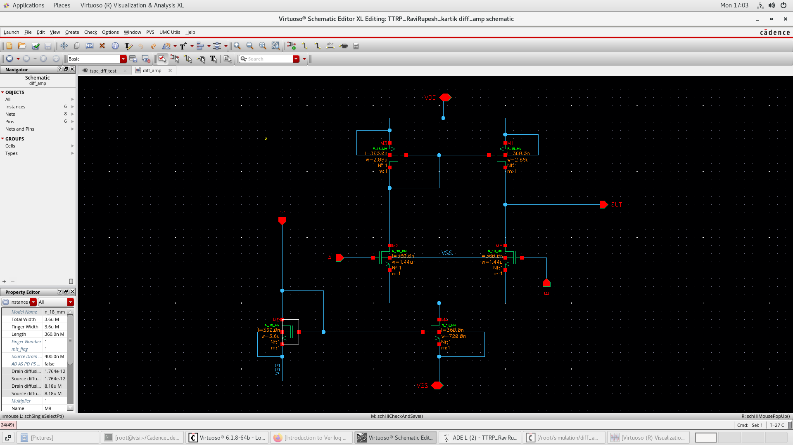

*Figure 1. Schematic of `diff_amp`: NMOS pair (centre), PMOS mirror (toward `VDD`), tail device (to `VSS`). Pins A and B are the inputs; `OUT` is taken from the non-diode-connected side of the mirror.*

| Device | Role | Model | W | L |
| --- | --- | --- | --- | --- |
| M1, M2 | Input pair | `N_18_MM` | 1.44 µm | 360 nm |
| PMOS pair | Mirror load | `P_18_MM` | 1.44 µm | 720 nm |
| Mref | Bias-mirror reference | `N_18_MM` | 3.6 µm | 360 nm |
| M0 | Tail current source | `N_18_MM` | 720 nm | 360 nm |

**Schematic checks performed:** matched input devices, matched PMOS loads, tail in series with the shared source, correct output node, supplies on `VDD`/`VSS`. Every later stage derives from this schematic, so it serves as the specification for the layout.

**Testbench sources**

| Source | Value | Purpose |
| --- | --- | --- |
| `vdc` | 1.8 V | Core supply |
| `idc` | 15 µA | Tail-bias reference |
| `vsin` (input A) | `VDC` = 0.9 V, `AC` = 0.5 V, amplitude = 5 mV, f = 1 kHz, 180° out of phase with B | Differential sine input |
| `vsin` (input B) | `VDC` = 0.9 V, `AC` = 0.5 V, amplitude = 5 mV, f = 1 kHz, 180° out of phase with A | Differential sine input |

## 9. Pre-layout simulation

The schematic netlist is simulated with ideal wires. Simulator state is saved as `spectre_state1` (transient, AC and DC enabled, Spectre, 27 °C).

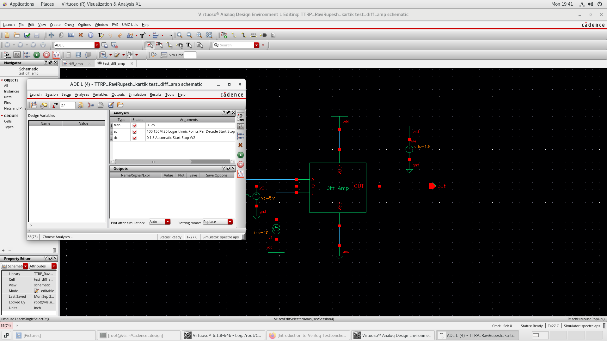

*Figure 2. Pre-layout testbench and ADE L setup.*

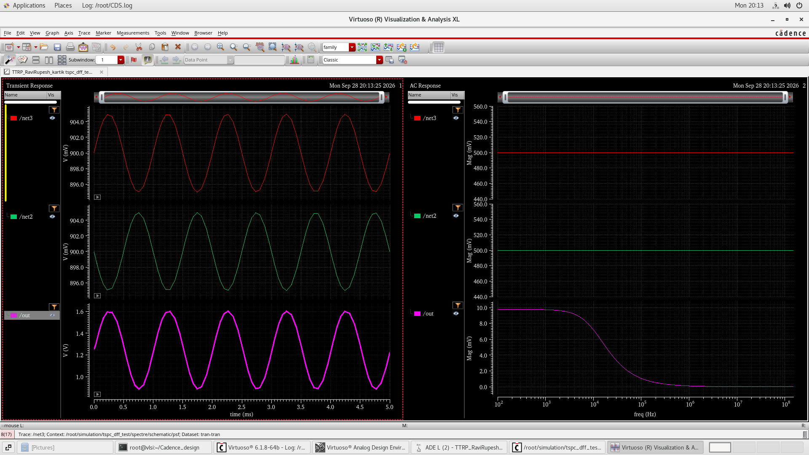

*Figure 3. Pre-layout results. Left: transient inputs and output (5 ms). Right: AC magnitude (100 Hz – 150 MHz).*

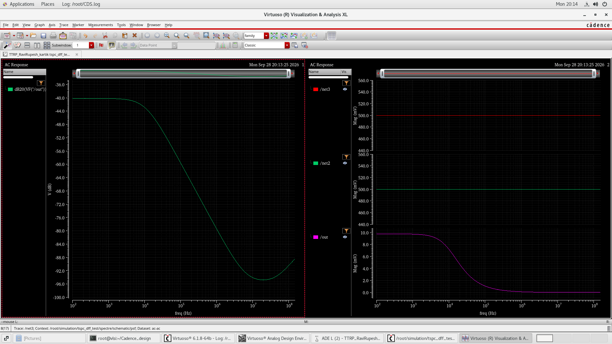

*Figure 4. Pre-layout gain, `dB20(VF("/out"))`.*

**Observations**

- **Transient:** the inputs are equal-amplitude, opposite-phase sines centred near 0.9 V, and `OUT` is a sine at the same frequency, as predicted in Section 4.2.
- **AC:** a flat passband followed by a smooth single-pole roll-off with no peaking, consistent with Section 5.
- **Purpose:** confirms that the schematic amplifies correctly and provides the reference for the post-layout comparison.

## 10. Layout, DRC and LVS

### 10.1 Layout

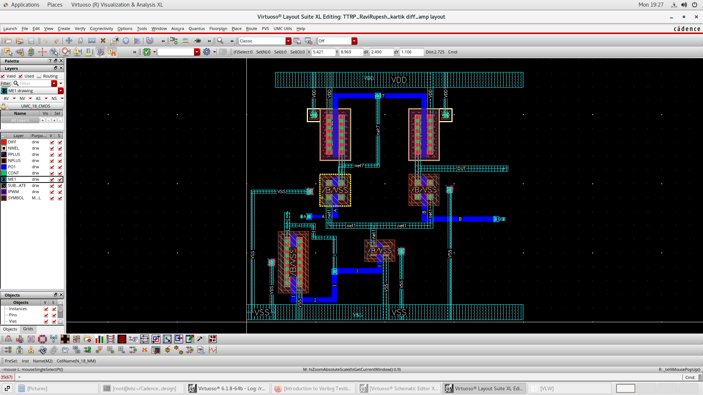

*Figure 5. Layout of `diff_amp`. PMOS loads along the top, input pair in the middle, tail devices along the bottom; Metal1 straps carry `VDD`, `VSS`, the inputs and `OUT`.*

The input pair is placed as a matched couple so that $I_{D1} = I_{D2}$ when $v_{id} = 0$. Net names (`VDD`, `VSS`, A, B, `OUT`) are carried over from the schematic.

### 10.2 DRC (Assura)

The design-rule check verifies width, spacing and enclosure rules of the UMC 180 nm deck.

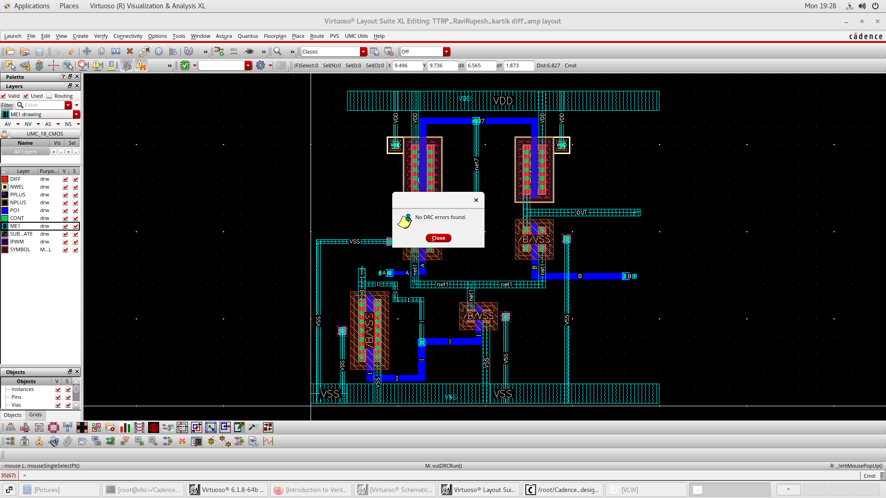

*Figure 6. Assura DRC: "No DRC errors found."*

### 10.3 LVS (Assura, run `exp1`)

LVS confirms that the layout implements the same circuit as the schematic.

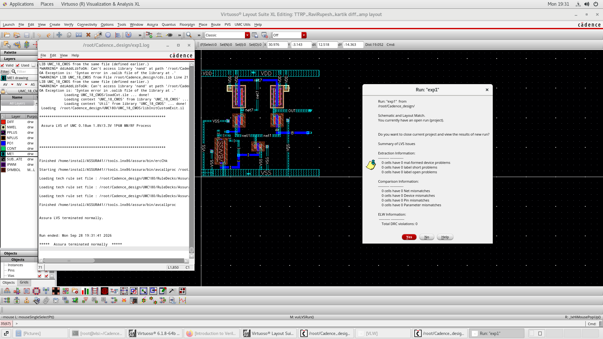

*Figure 7. Assura LVS: schematic and layout match.*

| LVS item | Result |
| --- | --- |
| Schematic vs layout | Match |
| Malformed devices, shorts, opens | None |
| Net / device / pin / parameter mismatches | 0 / 0 / 0 / 0 |
| DRC violations reported with the run | 0 |

DRC guarantees the layout can be manufactured; LVS guarantees it is functionally the same circuit. Both must pass before parasitics are extracted.

## 11. Parasitic extraction and post-layout simulation

### 11.1 Extraction (Quantus QRC, run `exp1`)

RC-decoupled extraction with `VSS` as the ground net, using the UMC 180 nm LPE deck. Output view: `av_extracted`.

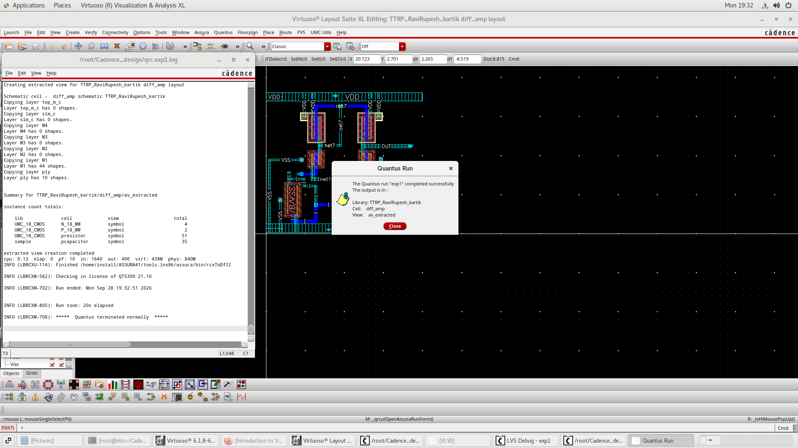

*Figure 8. Quantus QRC completed and created `diff_amp/av_extracted`.*

| Extracted instance | Count | Description |
| --- | --- | --- |
| `N_18_MM` | 4 | Input pair, tail and bias NMOS |
| `P_18_MM` | 2 | PMOS mirror load |
| `presistor` | 51 | Parasitic wire and contact resistance |
| `pcapacitor` | 35 | Parasitic capacitance to ground |

### 11.2 Binding the testbench to the extracted view

A **config** view makes the testbench instance of `diff_amp` use `av_extracted`, while the ideal sources keep their Spectre views. Without it, re-netlisting would simulate the schematic again. The config is stored in `temp_test/config`, with instance `I0` bound to `av_extracted`.

| | |
| --- | --- |
| 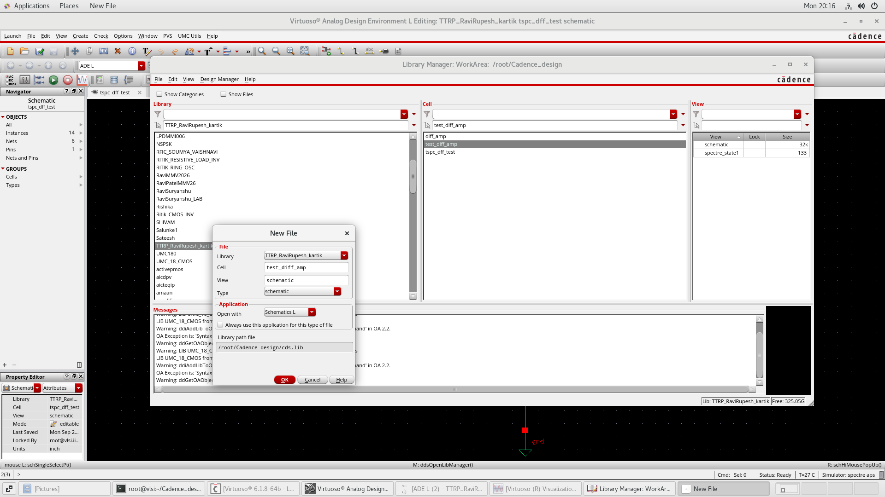 | 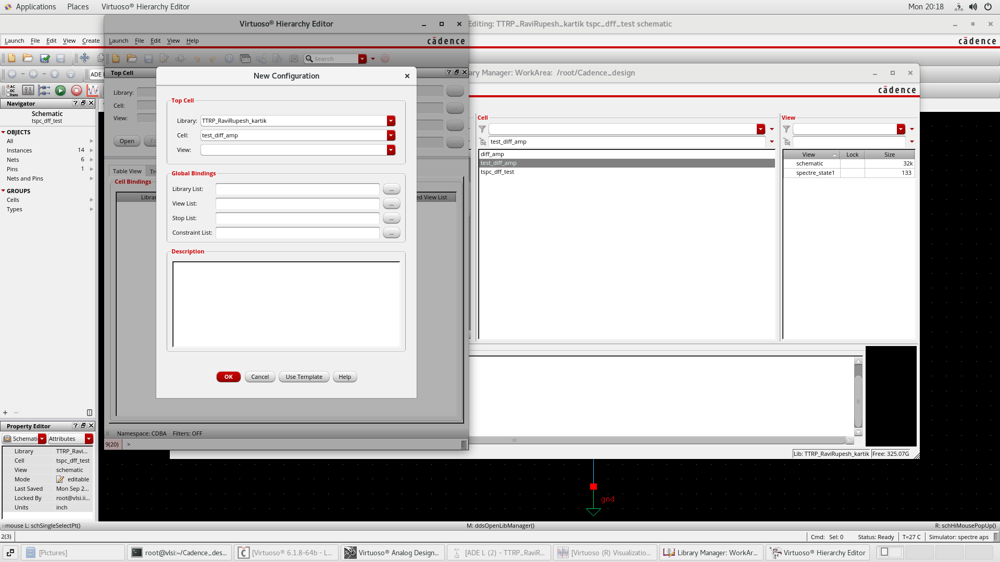 |
| *Figure 9. Open the testbench cell.* | *Figure 10. Create the config view.* |

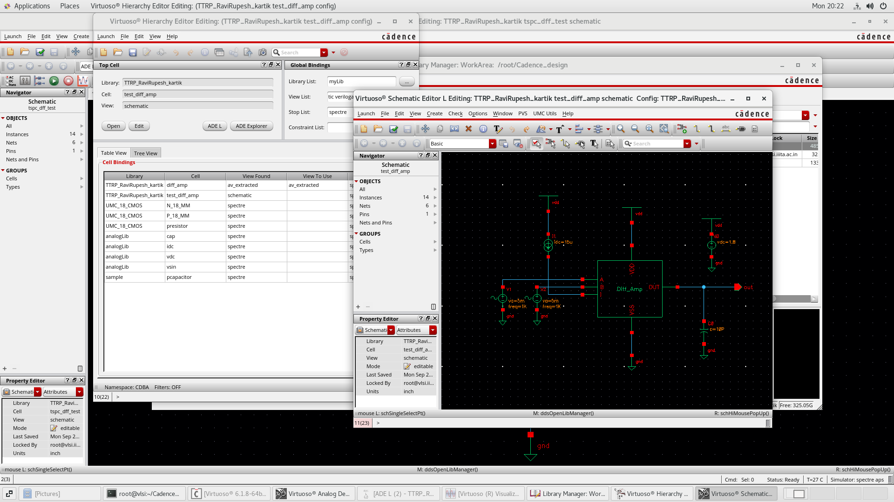

*Figure 11. Hierarchy Editor binding `diff_amp` to `av_extracted`.*

### 11.3 Post-layout results

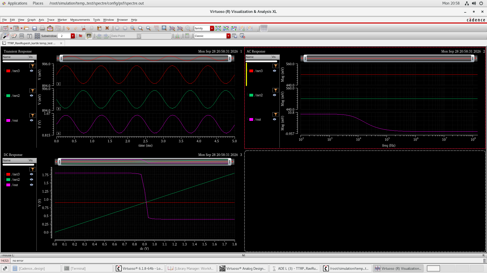

*Figure 12. Post-layout results. Top left: transient. Top right: AC magnitude. Bottom left: DC transfer curve.*

- **Transient:** opposite-phase input sines give a sinusoidal `OUT` at the same frequency, so the layout preserves differential action.
- **AC:** flat passband then a single-pole roll-off, now including the extracted $C_{out}$.
- **DC sweep:** a steep region where both sides of the pair are saturated (small-signal model valid), flattening where one device takes all of $I_{SS}$. This illustrates the input range described in Section 6.

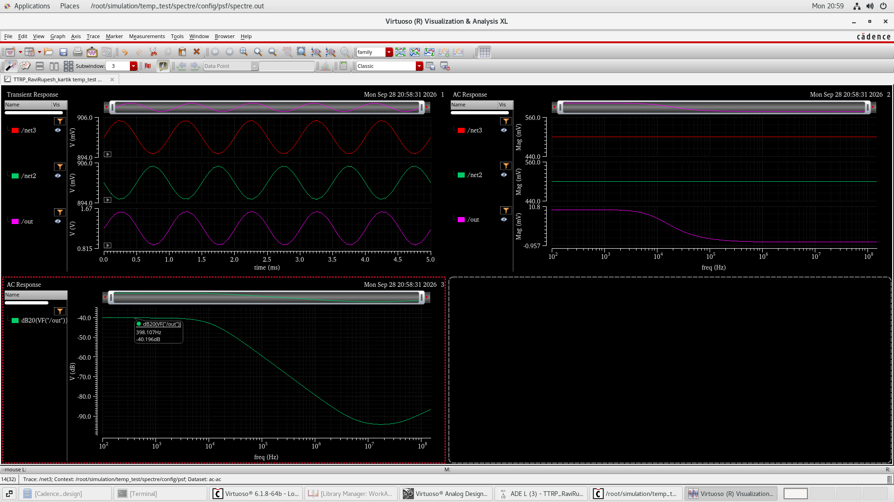

*Figure 13. Post-layout gain, `dB20(VF("/out"))`, with the passband marker at **−40.196 dB**.*

The marker corresponds to a linear value of

$$10^{-40.196/20} \approx 0.0098$$

> **Note on the gain value.** `dB20(VF("/out"))` equals the voltage gain in dB only when the AC stimulus seen by the amplifier is 1 V *and* is applied differentially. Two things must be confirmed in the testbench before quoting −40.196 dB as $A_{dm}$:
> 1. **AC magnitude.** If the AC sources are not 1 V (here 0.5 V each), subtract $20\log_{10}$ of the effective stimulus from the marker value.
> 2. **AC phase.** The transient sources are 180° out of phase; the AC sources must be as well (AC phase of 180° on one input). If both AC sources have the same phase, the AC sweep measures the *common-mode* gain $A_{cm}$ instead of $A_{dm}$.

## 12. Pre-layout vs post-layout comparison

Same testbench, same analyses, same gain definition. Only the view under the symbol changes: `schematic` → `av_extracted`.

| Check | Pre-layout | Post-layout |
| --- | --- | --- |
| Netlist | Schematic devices only | Devices + 51 resistors + 35 capacitors |
| Transient | Opposite-phase inputs, sinusoidal `OUT` | Same behaviour |
| AC shape | Flat passband, single roll-off | Flat passband, single roll-off |
| Gain marker | Flat passband at low frequency | **−40.196 dB** |
| DC transfer | Steep region, flat outside | Steep region, flat outside |
| Source of change | Model device capacitance only | Added wire R and C |

Since LVS matched, any shift between the two runs is caused by the extracted parasitics: extra $C_{out}$ lowers $f_p$, and series resistance slightly alters $R_{out}$ and $A_{dm}$.

## 13. Summary of results

| Result | Value |
| --- | --- |
| Process / supply | UMC 180 nm / 1.8 V |
| Topology | NMOS pair, NMOS tail, PMOS mirror load, single-ended output |
| Input pair | 1.44 µm / 360 nm |
| PMOS load | 1.44 µm / 720 nm |
| Bias-mirror reference | 3.6 µm / 360 nm |
| Tail device (M0) | 720 nm / 360 nm |
| Extracted devices | 4 × `N_18_MM`, 2 × `P_18_MM` |
| Bias / temperature | 15 µA reference / 27 °C |
| Power | Reference branch alone: 27 µW. Total supply power: read from the Spectre DC operating point (`I(VDD)`) |
| DRC | No errors |
| LVS | Match, 0 mismatches |
| Extraction | `av_extracted`, RC-decoupled, Quantus run `exp1` |
| Post-layout passband marker | **−40.196 dB** (`dB20(VF("/out"))`, see note in Section 11.3) |
| Frequency response | Flat passband, single-pole roll-off |

### Conclusion

Two matched NMOS transistors share a tail current, so a gate-voltage difference becomes a drain-current difference. The PMOS mirror converts that difference into a single-ended output, $v_{OUT} = g_m R_{out} v_{id}$, while all devices remain in saturation. The design was carried through a complete 180 nm flow: pre-layout simulation showed the expected differential and single-pole behaviour, the layout passed DRC and LVS, and the extracted view preserved the same behaviour with parasitics included.

## 14. Reproducing the design

### Requirements

- Cadence Virtuoso IC 6.1.8 (or a nearby IC 6.1 release) and Spectre
- UMC 180 nm design kit: `UMC_18_CMOS`, Assura rule decks, Quantus LPE deck
- Cadence `analogLib` and `basic` libraries

> Stale `*.cdslck` lock files may remain from a lab session. If a cell opens read-only, close other sessions and delete the lock files in that cell directory.

### Step 1: Register the libraries

Add to your `cds.lib`:

```text
DEFINE TTRP_RaviRupesh_kartik  /path/to/Ravi_diff
DEFINE UMC_18_CMOS             /path/to/UMC180/UMC_18_CMOS
```

The model section used is `mm180_reg18` (typical), under the kit's `Models/Spectre` directory.

### Step 2: Open the schematic

```bash
virtuoso &
```

In Library Manager, open `TTRP_RaviRupesh_kartik` → `diff_amp` → `schematic` (compare with Figure 1).

### Step 3: Pre-layout simulation

1. Open the testbench schematic (`temp_test`, or `test_diff_amp` if present).
2. Confirm the sources: 1.8 V supply, 15 µA tail-bias reference, and two `vsin` sources at A and B with 180° phase opposition, `VDC = 0.9 V`, `AC = 0.5 V`, `amplitude = 5 mV`, `f = 1 kHz`.
3. Launch **ADE L** and load `spectre_state1` (**Session → Load State**).
4. Verify the analyses: transient `5m`; AC 100 Hz – 150 MHz, 20 points/decade; DC sweep enabled.
5. Run **Simulation → Netlist and Run**.
6. Plot the inputs and `OUT` (transient), the AC magnitude, and `dB20(VF("/out"))`. Expected results are in Figures 3 and 4.

### Step 4: Layout, DRC, LVS and extraction (optional)

Open `diff_amp` → `layout` (compare with Figure 5). These runs need the UMC 180 nm decks.

1. **DRC:** run Assura DRC; expect "No DRC errors found".
2. **LVS:** run Assura LVS against the schematic; expect a match with zero mismatches.
3. **Extraction:** run Quantus QRC on the LVS run, RC-decoupled, ground net `VSS`, view name `av_extracted`.

The extracted view is already included, so this step can be skipped if you only want to re-simulate.

### Step 5: Post-layout simulation

1. Open `temp_test` → `config`, or create a config whose top cell is the testbench with the binding:

   ```text
   inst (TTRP_RaviRupesh_kartik.temp_test:schematic).I0 binding :av_extracted;
   ```

2. Open the testbench schematic **through that config**.
3. Launch ADE L and run the same transient, AC and DC analyses.
4. Plot `OUT` and `dB20(VF("/out"))`; the passband marker should read about **−40.2 dB** (Figure 13).

### Reproduction checklist

- [ ] Schematic shows an NMOS pair, PMOS mirror and NMOS tail
- [ ] Pre-layout transient gives a sine at `OUT` for a differential sine input
- [ ] AC gain is flat at low frequency, then rolls off
- [ ] DRC reports no errors; LVS reports a match
- [ ] Post-layout run of `av_extracted` shows the same sine and a marker near −40.2 dB

## 15. Repository structure

```text
Ravi_diff/
├── README.md
├── Image/                          figures referenced above
│   ├── Diff_amp_design_step1.png
│   ├── Pre_layout_sim_start_part1.png
│   ├── Prelayout_sim_plot1.png
│   ├── Pre_layout_sim_plot2.png
│   ├── Diff_amp_Layout.png
│   ├── Diff_amp_DRC_check.png
│   ├── Diff_amp_LVS_check.png
│   ├── Diff_amp_RC_extraction.png
│   ├── Post_layout_step1.png
│   ├── Post_layout_step2.png
│   ├── Post_layout_step3.png
│   ├── Post_layout_plot1.png
│   └── post_layout_plot2.png
├── diff_amp/                       Virtuoso cell
│   ├── schematic/
│   ├── symbol/
│   ├── layout/
│   ├── av_extracted/
│   ├── spectre_state1/
│   └── spectreText/
└── temp_test/                      testbench and post-layout config
    ├── schematic/
    └── config/
```

## 16. Glossary

| Term | Meaning |
| --- | --- |
| Differential-mode (DM) | The part of the input that is the *difference* between the two inputs |
| Common-mode (CM) | The part of the input that is *shared* by both inputs |
| $A_{dm}$, $A_{cm}$ | Differential-mode and common-mode gain |
| CMRR | Common-mode rejection ratio, $|A_{dm}/A_{cm}|$ |
| Tail current | The fixed current $I_{SS}$ shared by the input pair |
| Active load | A transistor circuit (here a current mirror) used in place of a resistor |
| Current mirror | Two matched transistors that force the same current in two branches |
| Saturation | Region where a MOSFET behaves as a voltage-controlled current source |
| ICMR | Input common-mode range: the CM voltages for which all devices stay saturated |
| DRC / LVS | Design-rule check / layout-versus-schematic check |
| Parasitics | Unintended wire resistance and capacitance extracted from the layout |
